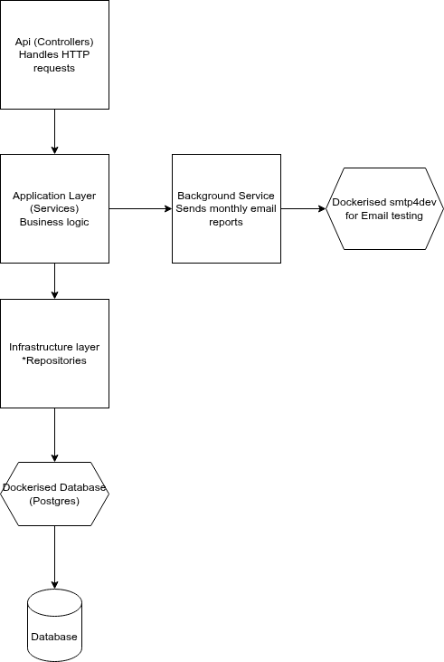

## 🚀 Features

- ASP.NET Core Web API (browse(view) products, add to cart, view cart of user, place order, view orders of a user)
- Entity Framework Core (PostgreSQL)
- Layered architecture:
    - `Shop.Api`: (Web Api)
    - `Shop.Application`: Business logic and services
    - `Shop.Contracts`: DTOs and shared contracts
    - `Shop.Infrastructure`: Data access
- BackgroundService to generate pdf of users' monthly orders and email them.
- Docker/docker-compose support for spinning up Postgres Db and smtp4dev for local testing
- Auto-migration and seeding data (Products and User) in development
- 

---

## 🛠️ Prerequisites

- [.NET 8 SDK](https://dotnet.microsoft.com/en-us/download/dotnet/8.0)
- If you intend to use the docker-compose, you must have Docker running locally.

---

## ▶️ Running the Application Locally
1. Clone the repository from Github
2. Run the docker-compose at the solution root, so it can spin up a Postgres database and smtp4dev (with matching configuration as in the solution)
3. Run the Shop.Api project, this will under the development environment also auto apply migrations and seed the tables Products and Users.Running Shop.Api, also runs the BackgroundService for generating and emailing monthly orders to users

DESIGN CONSIDERATIONS

## ✅ Code Quality
- Separation of responsibilities (Controller → Service → Repository)
- Unit tests for services (Cart, Order, Product) using xUnit + NSubstitute
- Business logic tested in isolation
- Code is async-first, making it responsive and scalable

## High Availability
- App is stateless — deployable behind a load balancer
- Uses dependency injection — can plug in caching, DB failover, etc.
- Background service can be promoted to a distributed job.

## Accessibility
- Consistent and well-documented HTTP endpoints (RESTful design)
- Clear validation errors (e.g., return 400 BadRequest with helpful messages)
 -JSON responses use simple, readable field names (DTOs)

## Fault-tolerance
- Errors in sending a report for one user do not affect others
- Email and PDF generation wrapped in try/catch
- Logs captured using ILogger for audit/debugging

## European Scale
- Application is stateless and region-agnostic (scale-out ready)
- Monthly tasks run on UTC to avoid timezone ambiguity
- Can integrate with any SMTP/email provider available in the EU
- Does not store unnecessary personal data — GDPR-friendly